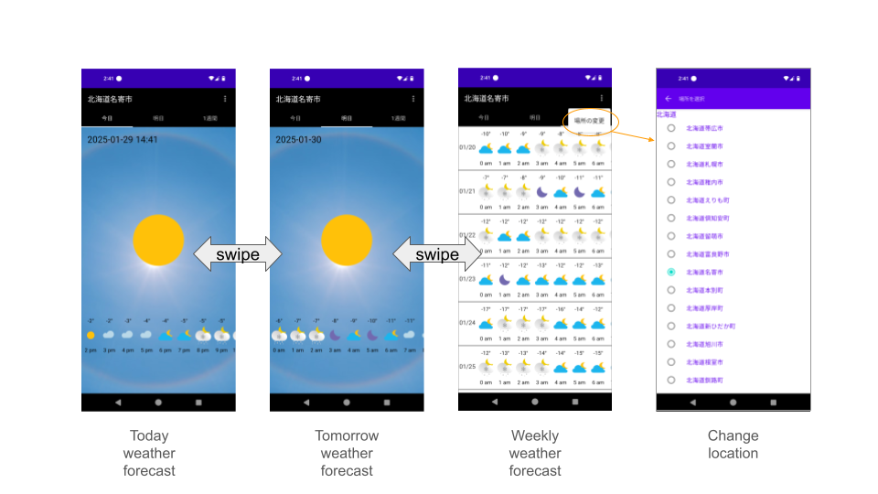
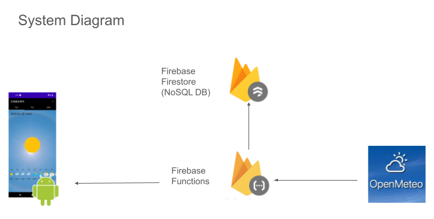

# Weather App

**Note: This app is developed for my playground. Not optimized and not maintained at all.**

This Android app displays forecasts for today, tomorrow, and one-week forecasts information obtained from [Open-Meteo.com](https://open-meteo.com).

The backend is built with Firebase Functions, and the Android app is developed using Kotlin and Jetpack Compose.

